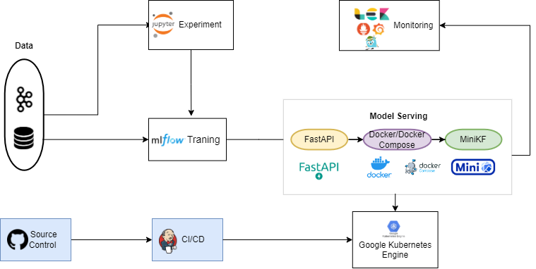
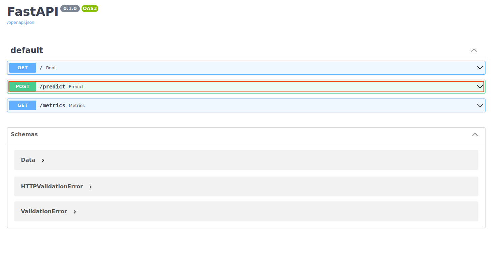
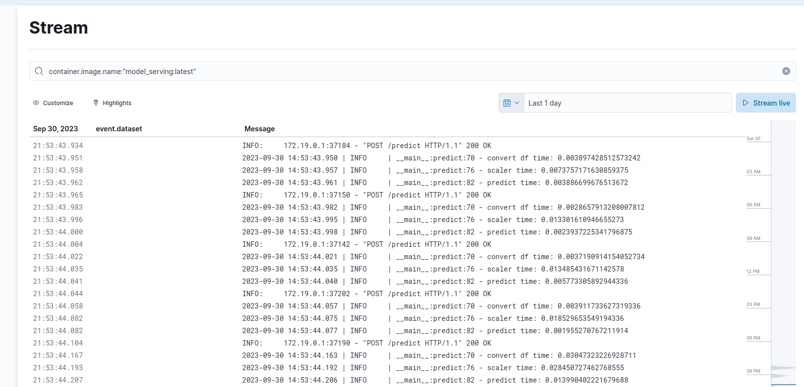
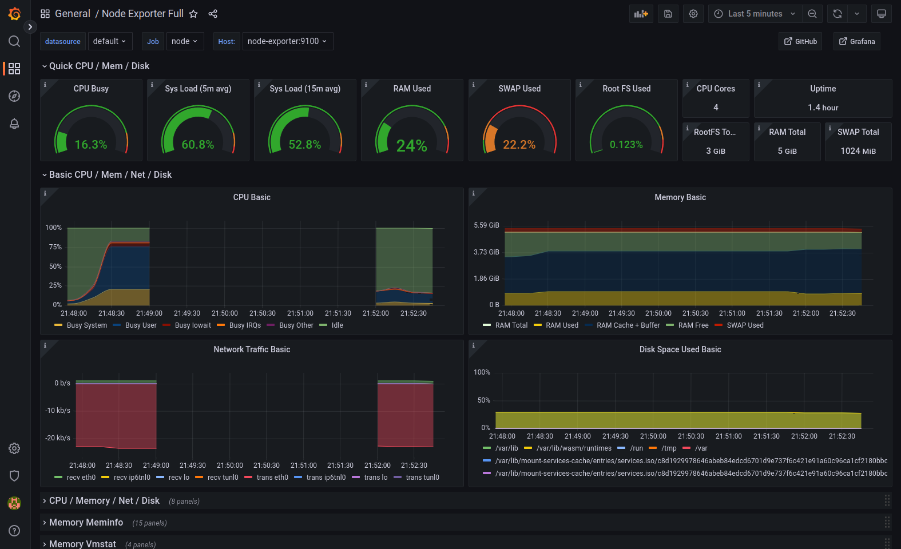
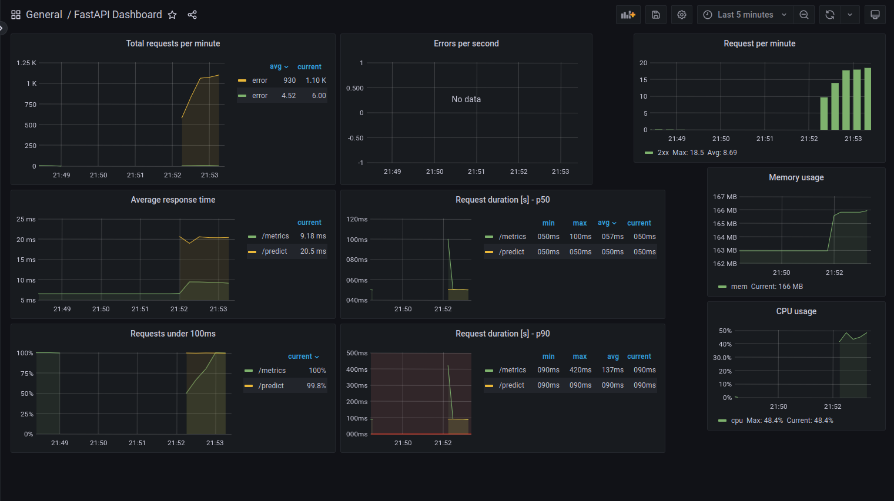
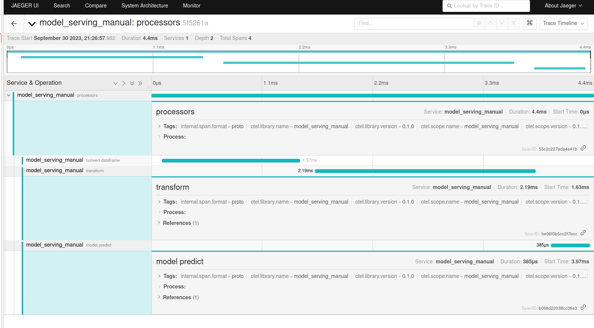
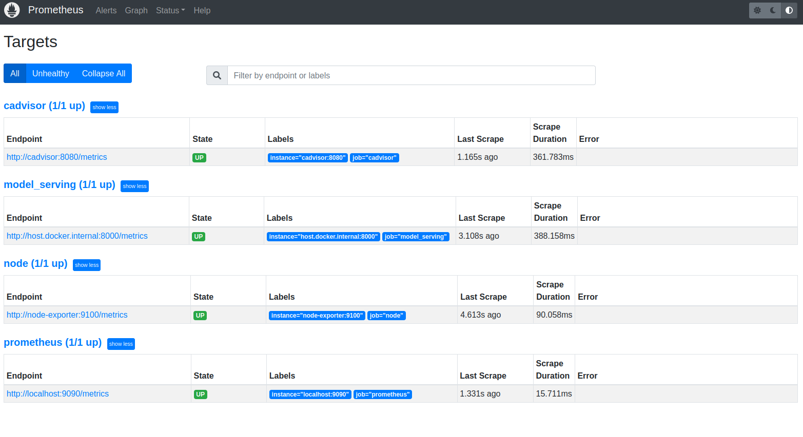
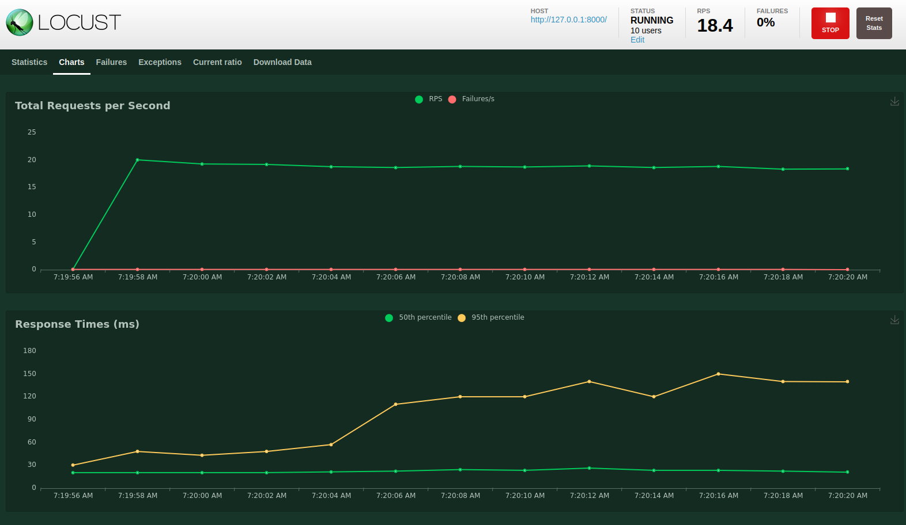

# diabetes_prediction_mlops

This is Final Project for MLE1 course. In this project,I gained experience in using a widely-used MLOps tool to create a model serving pipeline and implement a CI/CD process. This project demonstrates the application of MLOps principles and provides a foundational solution for addressing machine learning challenges.

Techstack I used in this project:

-  **MLFlow**: Model registry, artifact store

-  **FastAPI**: model serving

-  **Prometheus,Cadvisor**: metrics collector

-  **Grafana**: metrics visualization

-  **Jaeger**: tracing

-  **ElasticSearch, Logstash, Kibana**: logs collector and analysis

-  **Locust**: load test for model serving

-  **Docker,Docker-compose**: containerization

-  **Kubernetes,Helm**: container orchestration
-  **Jenkins**: CI/CD pipeline

-  **Github**: source version control

-  **Cloud service**: Google Kubernetes Engine

-  **Infrastructure as code**: Terraform,Ansible

## System Architecture


## Installation enviroment (Python3)
```bash
$sudo apt install cmake
$pip install -r requirements.txt
```
##   Training
```bash
$make mlflow_up
$python3 src/data_split.py #prepare data
$python3 src/train.py --model_name xgb
```

## Start local service
```bash
$make mlflow_up #start mlflow server
$make elk_up    #start logs collector
$make monitoring_up #start monitoring service(prometheus, grafana,jaeger)
$make predictor_up #start predictor service
```
Access to `localhost:8000/docs` for testing api

Access to `localhost:5601` for logs kibana search

Access to `localhost:3000` for grafana dashboard



Access to `localhost:16686` for jaeger tracing

Access to `localhost:9090` for prometheus

You can see dashboard for performance testing in grafana and tracing in jaeger
### Load test system
```bash
$locust -f src/load_test.py
#localhost**:8089
```

You can create request with different for testing performace system
### Cloud Service
You can see `README_cloud.md` for details setup and deploy to cloud service(GKE )  model serving and CI/CD pipeline
